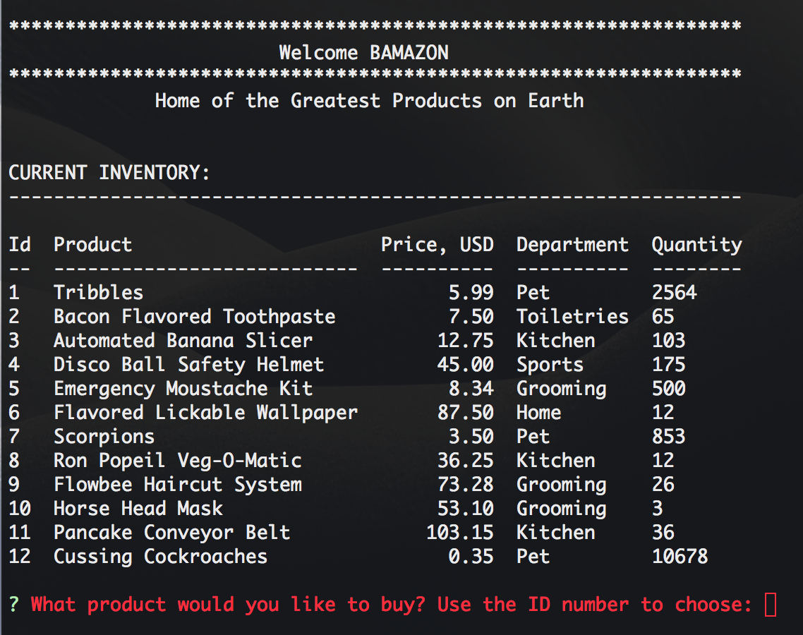

# Bamazon
A command line storefront app using MySQL, Inquirer, EasyTable, JS and Node

### Synopsis
***

A shopping app where MySQL and Node.js are used to allow users to purchase items as a customer.

##### Bamazon Customer Portal
***

The Bamazon Customer 'Portal' allows users to view the current items available for purchase.  The user will be prompted to enter the item id number and how many items they wish to purchase.  If the item is in stock, the order will be completed and the user will see the total amount of their purchase.

#### Contributors:
***

Peter Johnstone [GitHub](https://github.com/p2bilt)

#### Technologies Used:
***

* Javascript
* nodeJS
* MySQL
* npm packages:
	- [mysql](https://github.com/felixge/node-mysql)
	- [inquirer](github.com/SBoudrias/Inquirer.js)
	- [easy-table](github.com/eldargab/easy-table)

#### License
***

Copyright 2018 UNC Coding Bootcamp - Peter Johnstone

